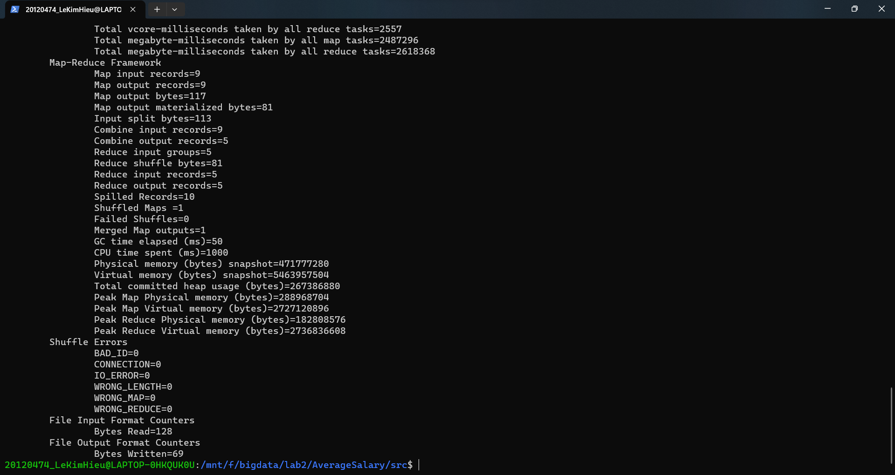
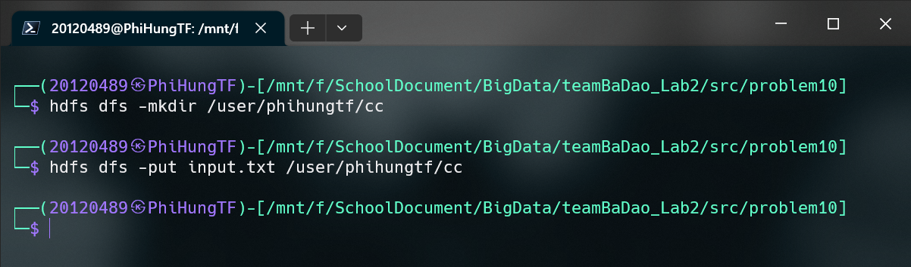

# Lab 02: MapReduce Programming

## Problem 01: WordCount Program

In the first section, we will try to solve a problem: Word count. The purpose of this issue is to calculate the number of nodes (words) that appear.

Here is an example of the input file:

```text
hello welcome
welcome to big data
data is good
```

To solve this problem, we easily split the input into two parts: key and the number of occurrences of the key. The result is as follows:

| key     | value |
| ------- | ----- |
| hello   | 1     |
| welcome | 1     |
| welcome | 1     |
| to      | 1     |
| big     | 1     |
| data    | 1     |
| data    | 1     |
| is      | 1     |
| good    | 1     |

Finally, we can sum up the values of each key. The result is as follows:

Now we can count the number of occurrences of each node. The result is as follows:

| key     | value |
| ------- | ----- |
| hello   | 1     |
| welcome | 2     |
| to      | 1     |
| big     | 1     |
| data    | 2     |
| is      | 1     |
| good    | 1     |

**Implementation with MapReduce**

We can implement this problem with MapReduce. The mapper will split the input into key and value. The reducer will sum up the values of each key.

Mapper:

```java
public static class Map extends Mapper<LongWritable, Text, Text, IntWritable> {
  private final static IntWritable one = new IntWritable(1);
  private Text word = new Text();

  public void map(LongWritable key, Text value, Context context) throws IOException, InterruptedException {
    // Split the input into key and value
    String line = value.toString();
    StringTokenizer tokenizer = new StringTokenizer(line);
    while (tokenizer.hasMoreTokens()) {
      word.set(tokenizer.nextToken());
      // Assign the value 1 to each node
      context.write(word, one);
    }
  }
}
```

Reducer:

```java
public static class Reduce extends Reducer<Text, IntWritable, Text, IntWritable> {
  public void reduce(Text key, Iterable<IntWritable> values, Context context)  throws IOException, InterruptedException {
    // Sum up the values of each node
    int sum = 0;
    for (IntWritable val : values) {
      sum += val.get();
    }
    // Label each node
    context.write(key, new IntWritable(sum));
  }
}
```

The full source code can be found [here](https://github.com/phihungtf/teamBaDao_Lab2/tree/main/src/problem01).

Here is the directory structure of the project:

```
📦problem01
 ┣ 📂output
 ┣ 📂input
 ┃  ┗ 📜 file01
 ┗ 📜WordCount.java
```

Now let's actually run the MapReduce job.

Create a new directory in the HDFS:

```bash
hadoop fs -mkdir /WordCount
hadoop fs -mkdir /WordCount/input
```

Copy the input file from the local file system to the HDFS:

```bash
hadoop fs -put Input/file01 /WordCount/input
```


Compile the `WordCount.java` file:

```bash
hadoop com.sun.tools.javac.Main WordCount.java
```

Create a JAR file:

```bash
sudo jar cf WordCount.jar WordCount*.class
```

Run the MapReduce job:

```bash
hadoop jar WordCount.jar WordCount /WordCount/input /WordCount/output
```


## Problem 02: WordSizeWordCount Program

In this section, we will try to solve a problem: WordSizeWordCount. The purpose of this problem is caculate the size of each word and count the number of words of that size in the text file

Here is an example of the input file:

```text
Hello everyone this is a sample dataset. Calculate the word size and count the number of words of that size in this text file
```
Idea: Split each word in file input and caculate its length, length of the word is a key and word is a value.After that, calculate frequency of each length of word

The program will be have three main components: Mapper, Reducer, and Driver 

The Mapper class is responsible for taking the input data and converting it into key-value pair. More specifically, it takes each word and caculate its length, output will be the length of the word as the key and the word itself as a value

| key     | value |
| ------- | ----- |
| 5       | Hello    |
| 8       | everyone     |
| 4       | this     |
| 2       | is     |
| 1       | a    |
| 6       | sample    |
| 8       | dataset.     |
| 9       | Calculate     |
| 3       | the     |
|...      |... |
| 4       |file |

The Reducer class takes ouput from the Mapper and performs the actual word count by aggregating all the values for a given key (which is the length of the word). The output of the Reducer is the length of the word as a key and the total count of words with that lenght as a value 

| key     | value |
| ------- | ----- |
| 1   | 1     |
| 2 | 4     |
| 3      | 3     |
| 4     | 8    |
| 5    | 3     |
|6      | 2 |
| 8      | 2     |
| 9    | 1     |


The Driver class sets up the configuration of the MapReduce job by specifying the input and output paths, the Mapper and Reducer classes to be used, and the input and output data formats.


**Implementation with MapReduce**

We can implement this problem with MapReduce. The mapper will split the input into key and value. The reducer will sum up the values of each key.

Mapper:

```java
public static class Map extends Mapper<LongWritable, Text, IntWritable, Text> {
        private static IntWritable count;
        private Text word = new Text();
        @Override
        public void map(LongWritable key, Text value, Mapper<LongWritable, Text, IntWritable, Text>.Context context) throws IOException, InterruptedException {
            String line = value.toString(); // Transfer to String type
            StringTokenizer stringTokenizer = new StringTokenizer(line); // Split the input String into separate tokens
            while (stringTokenizer.hasMoreTokens()) {
                String eWord = stringTokenizer.nextToken();  // Assign eWord variable for each word
                count = new IntWritable(eWord.length());  // Length of each word
                word.set(eWord);
                context.write(count, word);
            }
        }
    }
```

Reducer:

```java
public static class Reduce extends Reducer<IntWritable, Text, IntWritable, IntWritable> {

        @Override
        public void reduce(IntWritable key, Iterable<Text> values, Reducer<IntWritable, Text, IntWritable, IntWritable>.Context context)
                throws IOException, InterruptedException {
            int sum = 0;
            for (Text x : values) {
                sum++; // Calculate frequency of each length of word
            }
            context.write(key, new IntWritable(sum));
        }

    }
```

The full source code can be found [here](https://github.com/phihungtf/teamBaDao_Lab2/tree/main/src/problem02).

Here is the directory structure of the project:

```
📦problem02
 ┣ 📂output
 ┣ 📂input
 ┃  ┗ 📜WordSize.txt
 ┗ 📜WordSizeWordCount.java
```

Now let's actually run the MapReduce job.

Create a new directory in the HDFS:

```bash
hadoop dfs -mkdir /bai2
```

Copy the input file from the local file system to the HDFS:

```bash
hadoop dfs -put input/WordSize.txt /bai2
```


> > Create jar file and copy it into user home

Run the MapReduce job:

```bash
hadoop jar WordSize.jar hadoop.WordSizeWordCount /bai2 /output
```


## Problem 03: Weather Data

In this section, we will try to solve a problem: Weather Data. The purpose of this problem is find out the dates with maximum temperature greater than 40(A Hot Day) and minimum temperature lower than 10(A Cold Day).

Idea: Extract date from the line using the substring method as well as maximum temperature(compare with 40) and minimum temperature(compare with 10)

Here is an example of the input file:

```text
23907 20150101  2.423  -98.08   30.62     2.2    -0.6     0.8     0.9     6.2     1.47 C     3.7     1.1     2.5    99.9    85.4    97.2   0.369   0.308 -99.000 -99.000 -99.000     7.0     8.1 -9999.0 -9999.0 -9999.0
23907 20150102  2.423  -98.08   30.62     3.5     1.3     2.4     2.2     9.0     1.43 C     4.9     2.3     3.1   100.0    98.8    99.8   0.391   0.327 -99.000 -99.000 -99.000     7.1     7.9 -9999.0 -9999.0 -9999.0
23907 20150103  2.423  -98.08   30.62    15.9     2.3     9.1     7.5     2.9    11.00 C    16.4     2.9     7.3   100.0    34.8    73.7   0.450   0.397 -99.000 -99.000 -99.000     7.6     7.9 -9999.0 -9999.0 -9999.0
23907 20150104  2.423  -98.08   30.62     9.2    -1.3     3.9     4.2     0.0    13.24 C    12.4    -0.5     4.9    82.0    40.6    61.7   0.414   0.352 -99.000 -99.000 -99.000     7.3     7.9 -9999.0 -9999.0 -9999.0
23907 20150105  2.423  -98.08   30.62    10.9    -3.7     3.6     2.6     0.0    13.37 C    14.7    -3.0     3.8    77.9    33.3    57.4   0.399   0.340 -99.000 -99.000 -99.000     6.3     7.0 -9999.0 -9999.0 -9999.0
23907 20150106  2.423  -98.08   30.62    20.2     2.9    11.6    10.9     0.0    12.90 C    22.0     1.6     9.9    67.7    30.2    49.3   0.395   0.335 -99.000 -99.000 -99.000     8.0     8.0 -9999.0 -9999.0 -9999.0
23907 20150107  2.423  -98.08   30.62    10.9    -3.4     3.8     4.5     0.0    12.68 C    12.4    -2.1     5.5    82.7    36.5    55.7   0.387   0.328 -99.000 -99.000 -99.000     7.6     8.3 -9999.0 -9999.0 -9999.0
23907 20150108  2.423  -98.08   30.62     0.6    -7.9    -3.6    -3.3     0.0     4.98 C     3.9    -4.8    -0.5    57.7    37.6    48.1   0.372   0.316 -99.000 -99.000 -99.000     4.7     6.1 -9999.0 -9999.0 -9999.0
23907 20150109  2.423  -98.08   30.62     2.0     0.1     1.0     0.8     0.0     2.52 C     4.1     1.2     2.5    87.8    48.9    64.4   0.368   0.312 -99.000 -99.000 -99.000     5.4     6.2 -9999.0 -9999.0 -9999.0
23907 20150110  2.423  -98.08   30.62     0.5    -2.0    -0.8    -0.6     3.3     2.11 C     2.5    -0.1     1.4    99.9    47.7    85.8   0.373   0.314 -99.000 -99.000 -99.000     5.1     6.0 -9999.0 -9999.0 -9999.0
23907 20150111  2.423  -98.08   30.62    10.9     0.0     5.4     4.4     2.9     6.38 C    12.7     1.3     5.8   100.0    77.8    97.1   0.420   0.362 -99.000 -99.000 -99.000     6.5     6.7 -9999.0 -9999.0 -9999.0
23907 20150112  2.423  -98.08   30.62     6.5     1.4     4.0     4.3     0.0     1.55 C     6.9     2.7     5.1   100.0    89.4    97.8   0.412   0.350 -99.000 -99.000 -99.000     7.3     7.5 -9999.0 -9999.0 -9999.0
23907 20150113  2.423  -98.08   30.62     3.0    -0.7     1.1     1.2     0.0     3.26 C     5.6     0.7     2.9    99.7    80.7    90.7   0.401   0.337 -99.000 -99.000 -99.000     6.1     6.8 -9999.0 -9999.0 -9999.0
23907 20150114  2.423  -98.08   30.62     2.9     0.9     1.9     1.8     0.0     1.88 C     4.7     2.0     3.1    99.6    90.8    97.9   0.395   0.331 -99.000 -99.000 -99.000     6.1     6.7 -9999.0 -9999.0 -9999.0
23907 20150115  2.423  -98.08   30.62    13.2     1.2     7.2     6.4     0.0    13.37 C    16.4     1.4     6.7    98.9    46.7    73.4   0.395   0.333 -99.000 -99.000 -99.000     6.7     7.0 -9999.0 -9999.0 -9999.0
23907 20150116  2.423  -98.08   30.62    16.7     3.5    10.1     9.9     0.0    13.68 C    19.2     1.3     8.7    80.2    38.1    58.2   0.391   0.330 -99.000 -99.000 -99.000     7.3     7.4 -9999.0 -9999.0 -9999.0
```

To solve this problem, we easily split the input into two parts: key and the number of occurrences of the key. The result is as follows:

Assume that we have a input file like that:

```text
25380 20130101 20.0 -10.0 25.0 18.0 12.0 16.0 17.0 19.0 0.01 C 1.0 -0.1 0.4 97.3 36.0 69.4
25381 20130102 15.0 -20.0 22.0 14.0 10.0 12.0 13.0 14.0 0.02 C 1.0 -0.1 0.4 97.3 36.0 69.4
25382 20130103 30.0 -5.0 35.0 28.0 20.0 25.0 27.0 29.0 0.01 C 1.0 -0.1 0.4 97.3 36.0 69.4
```

The result will be:

```text
Cold Day 20130102	-20.0
Hot Day 20130103	30.0
```

**Implementation with MapReduce**

We can implement this problem with MapReduce. The mapper will split the input into two parts: key and value. The reducer will count the number of occurrences of each key.

Mapper:

```java
public static class MaxTemperatureMapper extends MapReduceBase implements Mapper<LongWritable, Text, Text, Text> {
        @Override
        public void map(LongWritable longWritable, Text text,
                        OutputCollector<Text, Text> outputCollector, Reporter reporter)
                throws IOException {
            String line = text.toString(); // Transfer to String type
            String date = line.substring(6, 14); // Get date data
            float tempMax = Float.parseFloat(line.substring(39, 45).trim()); // Get maximum temperature and transfer to float type
            float tempMin = Float.parseFloat(line.substring(47, 53).trim()); // Get minimum temperature and transfer to float type
            if (tempMax > 40.0) { // Check
                outputCollector.collect(new Text("Hot Day " + date),
                        new Text(String.valueOf(tempMax)));
            }
            if (tempMin < 10) {
                outputCollector.collect(new Text("Cold Day " + date),
                        new Text(String.valueOf(tempMin))); //
            }
        }
    }
```

Reducer:

```java
public static class MaxTemperatureReducer extends MapReduceBase implements Reducer<Text, Text, Text, Text> {
        @Override
        public void reduce(Text Key, Iterator<Text> iterator, OutputCollector<Text, Text> outputCollector, Reporter reporter) throws IOException {
            String temperature = iterator.next().toString();
            outputCollector.collect(Key, new Text(temperature));
        }
    }
```

The full source code can be found [here](https://github.com/phihungtf/teamBaDao_Lab2/tree/main/src/problem03).

Here is the directory structure of the project:

```
📦problem03
 ┣ 📂output
 ┣ 📂input
 ┃  ┗ 📜weather_data.txt
 ┗ 📜WeatherData.java
```

Now let's actually run the MapReduce job.

Create a new directory in the HDFS:

```bash
hadoop dfs -mkdir /bai3
```

Copy the input file from the local file system to the HDFS:

```bash
hadoop dfs -put home/20120573_npt/weather_data.txt /bai3
```


> > Create a jar file and copy it into user home

Run the MapReduce job:

```bash
hadoop jar WeatherData.jar hadoop.WeatherData /bai3 /output3
```


## Problem 04: Patent Program

In this section, we will try to solve a problem: Patent. The purpose of this issue is to calculate the number of patents that each inventor has.

Here is an example of the input file:

```text
1 1.11111
1 1.11113
1 1.11114
1 1.11311
1 1.11313
2 2.11311
2 2.11313
2 2.11314
2 2.11315
2 2.11316
2 2.11317
2 2.11318
2 2.11319
3 3.11311
3 3.11313
3 3.11314
3 3.11315
3 3.11316
3 3.11317
3 3.11318
3 3.11319
3 3.11321
3 3.11322
```

To solve this problem, we easily split the input into two parts: key and the number of occurrences of the key. The result is as follows:

| key | value   |
| --- | ------- |
| 1   | 1.11111 |
| 1   | 1.11113 |
| 1   | 1.11114 |
| 1   | 1.11311 |
| 1   | 1.11313 |
| 2   | 2.11311 |
| 2   | 2.11313 |
| 2   | 2.11314 |
| 2   | 2.11315 |
| 2   | 2.11316 |
| 2   | 2.11317 |
| 2   | 2.11318 |
| 2   | 2.11319 |
| 3   | 3.11311 |
| 3   | 3.11313 |
| 3   | 3.11314 |
| 3   | 3.11315 |
| 3   | 3.11316 |
| 3   | 3.11317 |
| 3   | 3.11318 |
| 3   | 3.11319 |
| 3   | 3.11321 |
| 3   | 3.11322 |

Finally, we can count the number of occurrences of each key. The result is as follows:

| key | value |
| --- | ----- |
| 1   | 5     |
| 2   | 8     |
| 3   | 10    |

**Implementation with MapReduce**

We can implement this problem with MapReduce. The mapper will split the input into two parts: key and value. The reducer will count the number of occurrences of each key.

Mapper:

```java
public static class Map extends Mapper<LongWritable, Text, Text, Text> {
  Text k = new Text();
  Text v = new Text();

  public void map(LongWritable key, Text value, Context context) throws IOException, InterruptedException {
    // Split the input into key and value
    String line = value.toString();
    StringTokenizer tokenizer = new StringTokenizer(line, " ");
    // signal the key and value
    while (tokenizer.hasMoreTokens()) {
      k.set(tokenizer.nextToken());
      v.set(tokenizer.nextToken());
      context.write(k, v);
    }
  }
}
```

Reducer:

```java
public static class Reduce extends Reducer<Text, Text, Text, IntWritable> {
  public void reduce(Text key, Iterable<Text> values, Context context) throws IOException, InterruptedException {
    // Count the number of occurrences of each key
    int sum = 0;
    for (Text x : values) {
      sum++;
    }
    // Label each node
    context.write(key, new IntWritable(sum));
  }
}
```

The full source code can be found [here](https://github.com/phihungtf/teamBaDao_Lab2/tree/main/src/problem04)

Here is the directory structure of the project:

```
📦problem04
 ┣ 📂output
 ┣ 📂input
 ┃  ┗ 📜 file01
 ┗ 📜Patent.java
```

Now let's actually run the MapReduce job.

Create a new directory in the HDFS:

```bash
hadoop fs -mkdir /Patent
hadoop fs -mkdir /Patent/input
```

Copy the input file from the local file system to the HDFS:

```bash
hadoop fs -put Input/file01 /Patent/input
```


Compile the `WordCount.java` file:

```bash
hadoop com.sun.tools.javac.Main Patent.java
```

Create a JAR file:

```bash
sudo jar cf Patent.jar Patent*.class
```

Run the MapReduce job:

```bash
hadoop jar Patent.jar Patent /Patent/input /Patent/output
```


## Problem 05: MaxTemp Program

Given a set of temperature records in specific format, write a MapReduce program to find out the maximum temperature for each year.

The input file is a text file with each line containing a temperature record in the following format:

```text
<Year> <Temperature>
```

For example, the following lines are temperature records:

```text
1900 36
1900 29
1901 32
1901 40
1901 29
1901 48
1901 16
1901 11
1901 21
1901 6
1901 22
1902 49
1902 49
```

To solve this problem, we need to find all temperature records for each year, then find the maximum temperature for each year.

**Implementation with MapReduce**

The first step is to write the mapper. It will read each line of the input file and output the year and the temperature.

`MaxTempMapper`:

```java
public static class MaxTempMapper extends Mapper<LongWritable, Text, IntWritable, FloatWritable> {
	public void map(LongWritable key, Text value, Context context) throws IOException, InterruptedException {
		// get the necessary fields from the input record
		String[] fields = value.toString().split("\\s+");
		String year = fields[0];
		String temp = fields[1];

		// emit the year and the temperature
		context.write(new IntWritable(Integer.parseInt(year)),
						new FloatWritable(Float.parseFloat(temp)));
	}
}
```

The reducer will read the year and the temperature, then find the maximum temperature for each year.

`MaxTempReducer`:

```java
public static class MaxTempReducer extends Reducer<IntWritable, FloatWritable, IntWritable, FloatWritable> {
	public void reduce(IntWritable key, Iterable<FloatWritable> values, Context context) throws IOException, InterruptedException {
		// find the maximum temperature
		float maxTemp = Float.MIN_VALUE;
		for (FloatWritable value : values) {
			if (value.get() > maxTemp) {
				maxTemp = value.get();
			}
		}

		// emit the year and the maximum temperature
		context.write(key, new FloatWritable(maxTemp));
	}
}
```

The full source code can be found [here](https://github.com/phihungtf/teamBaDao_Lab2/tree/main/src/problem05).

Here is the directory structure of the project:

```
📦problem05
┣ 📂output
┣ 📜input.txt
┗ 📜MaxTemp.java
```

Now let's actually run the MapReduce job.

Create a new directory in the HDFS:

```bash
hdfs dfs -mkdir /user/phihungtf/mt
```

Copy the input file from the local file system to the HDFS:

```bash
hdfs dfs -put input.txt /user/phihungtf/mt
```


Compile the `MaxTemp.java` file:

```bash
hadoop com.sun.tools.javac.Main MaxTemp.java
```

Create a JAR file:

```bash
sudo jar cf mt.jar MaxTemp*.class
```

Run the MapReduce job:

```bash
hadoop jar mt.jar MaxTemp /user/phihungtf/mt/input.txt /user/phihungtf/mt/output
```


Copy the output files from the HDFS to the local file system:

```bash
hdfs dfs -get /user/phihungtf/mt/output/* output
```

Examine the output files:

```bash
cat output/*
```


## Problem 06: AverageSalary Program

In this section, we will try to solve a problem: Average Salary. The purpose of this issue is to calculate the average salary of each department.

Here is an example of the input file:

```text
20120474,9.3
20120475,9.3
20120476,9.3
20120477,9.8
20120474,10.2
20120475,10.2
20120476,10.5
20120477,10.5
20120478,9.6
```

To solve this problem, we easily split the input into two parts: key and the number of occurrences of the key. The result is as follows:

| key      | value |
| -------- | ----- |
| 20120474 | 9.3   |
| 20120475 | 9.3   |
| 20120476 | 9.3   |
| 20120477 | 9.8   |
| 20120474 | 10.2  |
| 20120475 | 10.2  |
| 20120476 | 10.5  |
| 20120477 | 10.5  |
| 20120478 | 9.6   |

Finally, we can count Average Salary of each department. The result is as follows:

| key      | value |
| -------- | ----- |
| 20120474 | 9.75  |
| 20120475 | 9.75  |
| 20120476 | 9.9   |
| 20120477 | 10.15 |
| 20120478 | 9.6   |

**Implementation with MapReduce**

We can implement this problem with MapReduce. The mapper will split the input into key and value. The reducer will count Average Salary of each department.

Mapper:

```java
public static class avgMapper extends Mapper<Object, Text, Text, FloatWritable> {
  private Text dept_id = new Text();
  private FloatWritable salary = new FloatWritable();
  public void map(Object key, Text value, Context context) throws IOException, InterruptedException {
    // Split the input into key and value
    String line = value.toString();
    StringTokenizer itr = new StringTokenizer(line, ",");
    // signal the key and value
    while (itr.hasMoreTokens()) {
      dept_id.set(itr.nextToken());
      salary = new FloatWritable(Float.parseFloat(itr.nextToken()));
      context.write(dept_id, salary);
    }
  }
}
```

Reducer:

```java
public static class avgReducer extends Reducer<Text, FloatWritable, Text, FloatWritable> {
  private FloatWritable result = new FloatWritable();
  public void reduce(Text key, Iterable<FloatWritable> values, Context context)
      throws IOException, InterruptedException {
    // Count sum and calculate the average salary
    float sum = 0;
    float count = 0;
    for (FloatWritable val : values) {
      sum += val.get();
      count++;
    }
    // Label each node
    result.set(sum / count);
    context.write(key, result);
  }
}
```

The full source code can be found [here](https://github.com/phihungtf/teamBaDao_Lab2/tree/main/src/problem06).

Here is the directory structure of the project:

```
📦problem06
 ┣ 📂output
 ┣ 📂input
 ┃  ┗ 📜 file01
 ┗ 📜AverageSalary.java
```

Now let's actually run the MapReduce job.

Create a new directory in the HDFS:

```bash
hadoop fs -mkdir /AverageSalary
hadoop fs -mkdir /AverageSalary/input
```

Copy the input file from the local file system to the HDFS:

```bash
hadoop fs -put Input/file01 /AverageSalary/input
```


Compile the `AverageSalary.java` file:

```bash
hadoop com.sun.tools.javac.Main AverageSalary.java
```

Create a JAR file:

```bash
sudo jar cf AverageSalary.jar AverageSalary*.class
```

Run the MapReduce job:

```bash
hadoop jar AverageSalary.jar AverageSalary /AverageSalary/input /AverageSalary/output
```





## Problem 07: De Identify HealthCare Program
In this section, we will try to solve a problem: De Identify HealthCare. The purpose of this problem is to perform data de-identification by encrypting specific columns in a CSV file using AES algorithm.

Idea: Takes a CSV file as input, and for each row in the file, it identifies the columns to be encrypted based on a pre-defined list of column indexes, then applied ASE encryption to the values in the identified columns.

Here is an example of the input file:

```csv
PatientId	Name 	DOB	Phone Number	Email_Address	SSN	Gender	Disease	weight
11111	bbb1	12/10/1950	1230000000	bb1@xxx.com	1110000000	M	Diabetes	78
11112	bbb2	12/10/1984	1230000000	bb2@xxx.com	1110000000	F	PCOS	67
11113	bbb3	12/11/1940	1230000000	bb3@xxx.com	1110000000	M	Fever	90
11114	bbb4	12/12/1950	1230000000	bb4@xxx.com	1110000000	F	Cold	88
11115	bbb5	12/13/1960	1230000000	bb5@xxx.com	1110000000	M	"Blood 
Pressure"	76
11116	bbb6	12/14/1970	1230000000	bb6@xxx.com	1110000000	F	Malaria	84
```

**Implementation with MapReduce**

The input record is passed as a Text object to the function, which is then converted to a String using the toString() method. 
The function first creates a list of field numbers that need to be encrypted, based on the encryptCol array. Split the input record. The function then iterates over each field and checks whether it needs to be encrypted. If the field is in the list of encrypted fields, the encrypt function is called to encrypt the field using the encryptKey byte array. 
After processing all fields, the newStr string is written to the output using the context.write() method, with a NullWritable key and a Text value containing the transformed record.

Mapper:
```java
public static class Map extends Mapper<Object, Text, NullWritable, Text> {
        public void map(Object key, Text value, Context context)
                throws IOException, InterruptedException {
            StringTokenizer itr = new StringTokenizer(value.toString(),",");
            List<Integer> list=new ArrayList<Integer>();
            Collections.addAll(list, Columns);
            String newString="";
            int counter=1;
            while (itr.hasMoreTokens()) { // Checks whether the current column being processed is one of the columns to be encrypted, as specified in the Columns array.
                String token=itr.nextToken();
                if(list.contains(counter))
                {
                    if(newStr.length()>0)
                        newString+=",";
                    newString+=encrypt(token, encryptionKey); // Encrypt token and append to the "newString"
                }
                else
                {
                    if(newStr.length()>0)
                        newString+=",";
                    newString+=token; // The original token value is appened to the "newString"
                }
                counter=counter+1;
            }
            context.write(NullWritable.get(), new Text(newStr.toString())); 
        }
    }
```

Encryption
```java
public static String encrypt(String encryptString, byte[] key)
    {
        try
        {
            Cipher cipher = Cipher.getInstance("AES/ECB/PKCS5Padding");
            SecretKeySpec secretKey = new SecretKeySpec(key, "AES");
            cipher.init(Cipher.ENCRYPT_MODE, secretKey);
            String encryptedString = Base64.encodeBase64String(cipher.doFinal(encryptString.getBytes()));
            return encryptedString.trim();
        }
        catch (Exception e)
        {
            logger.error("Error encrypting", e);
        }
        return null;
    }
```

#### help me to enter link to the source code

The full source code can be found [here](.............).

Here is the directory structure of the project:

```
📦src
 ┣ 📂output
 ┣ 📂Input
 ┃  ┗ 📜 file01
 ┗ 📜DeIdentifyData.java
```

Now let's actually run the MapReduce job.

Create a new directory in the HDFS:

```bash
hadoop dfs -mkdir /bai7
```

Copy the input file from the local file system to the HDFS:

```bash
hadoop dfs -put home/20120573_npt/Health.csv /bai7
```


Create a jar file and copy it into user home

Run the MapReduce job:

```bash
hadoop jar DeIdentifyData.jar hadoop.DeIdentifyData /bai7/Health.csv /Bai8
```


## Problem 08: Music Track Program

In this section, we will try to solve a problem: Music track. The purpose of this problem is find the number of unique listeners per track from dataset

Idea: Extract the track Id(key) and user Id(value). Remove duplicate and writes a key-value pair where the key is the track Id and the value is the number of unique listeners for that track.

Here is an example of the input file:

```text
111115|222|0|1|0
111113|225|1|0|0
111117|223|0|1|1
111115|225|1|0|0
```

**Implementation with MapReduce**

We can implement this problem with MapReduce. The mapper will split the input into key and value. The reducer will count Average Salary of each department.

Constants:

```java
public class LastFMConstants {
    public static final int USER_ID = 0;
    public static final int TRACK_ID = 1;
    public static final int IS_SHARED = 2;
    public static final int RADIO = 3;
    public static final int IS_SKIPPED = 4;
}
```

Mapper:

```java
public static class UniqueListenersMapper extends Mapper<Object, Text, IntWritable, IntWritable> {
        IntWritable trackId = new IntWritable();
        IntWritable userId = new IntWritable();
        @Override
        public void map(Object key, Text value,
                        Mapper<Object, Text, IntWritable, IntWritable>.Context context)
                throws IOException, InterruptedException {
            String[] parts = value.toString().split("[|]"); // Split input value with regex(|)
            trackId.set(Integer.parseInt(parts[LastFMConstants.TRACK_ID])); // Assign trackId
            userId.set(Integer.parseInt(parts[LastFMConstants.USER_ID])); // Assign userId
            if (parts.length == 5) { // Check invalid record
                context.write(trackId, userId);
            } else {
                context.getCounter(COUNTERS.INVALID_RECORD_COUNT).increment(1L);
            }
        }
    }
```

Reducer:

```java
    public static class UniqueListenersReducer extends
            Reducer<IntWritable, IntWritable, IntWritable, IntWritable> {

        public void reduce(IntWritable trackId, Iterable<IntWritable> userIds, Reducer<IntWritable, IntWritable, IntWritable, IntWritable>.Context context)
                throws IOException, InterruptedException {
            Set<Integer> userIdSet = new HashSet<Integer>();
            for (IntWritable userId : userIds) { // Extracts the unique user IDs for a given track ID
                userIdSet.add(userId.get());
            }
            IntWritable size = new IntWritable(userIdSet.size());
            context.write(trackId, size); // Return key-value pair with trackId as a key and the number of user Id as a value
        }
    }
```
```

The full source code can be found [here](https://github.com/phihungtf/teamBaDao_Lab2/tree/main/src/problem08).

Here is the directory structure of the project:

```
📦problem08
 ┣ 📂output
 ┣ 📂input
 ┃  ┗ 📜 LastFMlog.txt
 ┗ 📜UniqueListeners.java
```

Now let's actually run the MapReduce job.

Create a new directory in the HDFS:

```bash
hadoop dfs -mkdir /bai8
```

Copy the input file from the local file system to the HDFS:

```bash
hadoop dfs -put home/20120573_NPT/bai8.txt /bai8
```


Create a jar file and copy it into user home

Run the MapReduce job:

```bash
hadoop jar UniqueListeners.jar hadoop.UniqueListeners /bai8 /output8
```


## Problem 09: Telecom Call Data Record Program

Given a set of call records in specific format, write a MapReduce program to find out all phone numbers who are making more than 60 mins of STD Calls.

The input file is a text file with each line containing a call record in the following format:

```text
<Caller Phone Number>|<Receiver Phone Number>|<Call Start Time>|<Call End Time>|<Call Type>
```

For example, the following lines are call records:

```text
9665128505|8983006310|2015-03-01 07:08:10|2015-03-01 08:12:15|0
9665128505|8983006310|2015-03-01 09:08:10|2015-03-01 09:12:15|1
9665128505|8983006310|2015-03-01 09:08:10|2015-03-01 10:12:15|0
9665128506|8983006310|2015-03-01 09:08:10|2015-03-01 10:12:15|1
9665128507|8983006310|2015-03-01 09:08:10|2015-03-01 10:12:15|1
9665128505|8983006310|2015-03-01 09:08:10|2015-03-01 10:12:15|1
```

To solve this problem, we need to calculate the total duration of STD calls for each phone number. If the total duration is more than 60 mins, then we will output the phone number.

**Implementation with MapReduce**

The first step is to write the mapper. It will read each line of the input file and output the phone number and the duration of its STD call. If the call is not a STD call, no output will be produced.

`STDMapper`:

```java
public static class STDMapper extends Mapper<LongWritable, Text, Text, LongWritable> {

	public void map(LongWritable key, Text value, Context context) throws IOException, InterruptedException {
		// get the necessary fields from the input record
		String[] fields = value.toString().split("\\|");
		String fromPhoneNum = fields[0];
		String callStartTimeStr = fields[2];
		String callEndTimeStr = fields[3];
		String stdFlag = fields[4];

		// check if the call is STD call
		if (stdFlag.equals("1")) {
			SimpleDateFormat sdf = new SimpleDateFormat("yyyy-MM-dd HH:mm:ss");
			Date callStartTime = null;
			Date callEndTime = null;
			try { // parse the date strings
				callStartTime = sdf.parse(callStartTimeStr);
				callEndTime = sdf.parse(callEndTimeStr);

			} catch (ParseException e) {
				e.printStackTrace();
			}

			// calculate the duration of the call in minutes
			long durationInMinutes = (callEndTime.getTime() - callStartTime.getTime()) / (60 * 1000);

			// emit the phone number and duration of the call
			context.write(new Text(fromPhoneNum), new LongWritable(durationInMinutes));
		}
	}
}
```

The reducer will read the phone number and the duration of its STD calls, then sum up the duration of all STD calls and output the phone number if the total duration is more than 60 mins.

`STDReducer`:

```java
public static class STDReducer extends Reducer<Text, LongWritable, Text, NullWritable> {
	public void reduce(Text key, Iterable<LongWritable> values, Context context) throws IOException, InterruptedException {
		long totalDuration = 0; // total duration of the calls made by the subscriber

		// calculate the total duration of the calls made by the subscriber
		for (LongWritable val : values) {
			totalDuration += val.get();
		}
		// check if total duration is greater than 60 minutes
		// if yes, emit the phone number
		if (totalDuration > 60) {
			context.write(key, NullWritable.get());
		}
	}
}
```

The full source code can be found [here](https://github.com/phihungtf/teamBaDao_Lab2/tree/main/src/problem09).

Here is the directory structure of the project:

```
📦problem09
┣ 📂output
┣ 📜CDRlog.txt
┗ 📜STDSubscribers.java
```

Now let's actually run the MapReduce job.

Create a new directory in the HDFS:

```bash
hdfs dfs -mkdir /user/phihungtf/std
```

Copy the input file from the local file system to the HDFS:

```bash
hdfs dfs -put CDRlog.txt /user/phihungtf/std
```


Compile the `STDSubscribers.java` file:

```bash
hadoop com.sun.tools.javac.Main STDSubscribers.java
```

Create a JAR file:

```bash
sudo jar cf std.jar STDSubscribers*.class
```

Run the MapReduce job:

```bash
hadoop jar std.jar STDSubscribers /user/phihungtf/std/CDRlog.txt /user/phihungtf/std/output
```


Copy the output files from the HDFS to the local file system:

```bash
hdfs dfs -get /user/phihungtf/std/output/* output
```

Examine the output files:

```bash
cat output/*
```


## Problem 10: Count Connected Component Program

Given an adjacency list representation of a undirected graph, write a MapReduce program to count the number of connected components.

In normal programming, we can use a `visited` array to keep track of the visited nodes. Then we can use a `DFS` or `BFS` algorithm to traverse the graph and count the number of connected components. But in MapReduce, we cannot use a `visited` array. So we have to use a different approach.

Suppose we have a graph with its adjacency list representation

```text
0 9
1 4 9
2 7
3 5 8
4 1
5 3
6
7 2
8 3
9 0 1
```

and the visualization of the graph


The point is that we will find the classifier of each connected component. In this case, it is the lowest node in each connected component. In the graph above, there are 4 connected components: `[0, 9, 1, 4]; [2, 7]; [8, 3, 5]; [6]` and their corresponding classifiers are `0`, `2`, `3`, and `6`.

There is a technique called `Message Passing` which was mentioned by Jimmy Lin and Michael Schatz in the _Design patterns for efficient graph algorithms in MapReduce_[^1] paper. "_The idea behind this is, that you let the vertices pass messages if a new local minima has been found. Afterwards you are just merging the messages with the real vertices and apply updates on the vertices that had a higher minimum._"[^2]

For example, in terms of node `1` in the graph above, it has two neighbors: `4` and `9`. So it will send a message to its neighbors. The message will contain the neighbor's ID and the lowest node among them. In this case, the messages will be `4: 1` and `9: 1`. The node `1` itself also sends a vertex that contain its own ID, the lowest node among them, and the list of nodes that it points to, which is `[4, 9]`. Here is the complete message passing process:

| Node | Vertex        |   Messages   |
| :--: | :------------ | :----------: |
|  0   | 0: 0 > [9]    |     9: 0     |
|  1   | 1: 1 > [4, 9] | 4: 1<br>9: 1 |
|  2   | 2: 2 > [7]    |     7: 2     |
|  3   | 3: 3 > [5, 8] | 5: 3<br>8: 3 |
|  4   | 4: 1 > [1]    |     1: 1     |
|  5   | 5: 3 > [3]    |     3: 3     |
|  6   | 6: 6 > []     |              |
|  7   | 7: 2 > [2]    |     2: 2     |
|  8   | 8: 3 > [3]    |     3: 3     |
|  9   | 9: 0 > [0, 1] | 0: 0<br>1: 0 |

Afterwards, we can merge the messages and the real vertices that have the same key and apply updates on the vertices that had a higher minimum.

| Node | Vertex & Messages             |  New Vertex   | Is Updated? |
| :--: | :---------------------------- | :-----------: | :---------: |
|  0   | 0: 0 > [9]<br>0: 0            |  0: 0 > [9]   |     No      |
|  1   | 1: 1 > [4, 9]<br>1: 1<br>1: 0 | 1: 0 > [4, 9] |     Yes     |
|  2   | 2: 2 > [7]<br>2: 2            |  2: 2 > [7]   |     No      |
|  3   | 3: 3 > [5, 8]<br>3: 3<br>3: 3 | 3: 3 > [5, 8] |     No      |
|  4   | 4: 1 > [1]<br>4: 1            |  4: 1 > [1]   |     No      |
|  5   | 5: 3 > [5]<br>5: 3            |  5: 3 > [5]   |     No      |
|  6   | 6: 6 > []                     |   6: 6 > []   |     No      |
|  7   | 7: 2 > [2]<br>7: 2            |  7: 2 > [2]   |     No      |
|  8   | 8: 3 > [3]<br>8: 3            |  8: 3 > [3]   |     No      |
|  9   | 9: 0 > [0, 1]<br>9: 0<br>9: 1 | 9: 0 > [0, 1] |     No      |

With the new vertex that was updated, we again send messages to its neighbors and repeat the processes until there is no change in the vertex. As the example above, only node `1` was updated. So we only need to send messages to its neighbors. The new message passing process is:

| Node | Vertex        |   Messages   |
| :--: | :------------ | :----------: |
|  0   | 0: 0 > [9]    |              |
|  1   | 1: 0 > [4, 9] | 4: 0<br>9: 0 |
|  2   | 2: 2 > [7]    |              |
|  3   | 3: 3 > [5, 8] |              |
|  4   | 4: 1 > [1]    |              |
|  5   | 5: 3 > [3]    |              |
|  6   | 6: 6 > []     |              |
|  7   | 7: 2 > [2]    |              |
|  8   | 8: 3 > [3]    |              |
|  9   | 9: 0 > [0, 1] |              |

And merge the messages and the real vertices again:

| Node | Vertex & Messages     |  New Vertex   | Is Updated? |
| :--: | :-------------------- | :-----------: | :---------: |
|  0   | 0: 0 > [9]            |  0: 0 > [9]   |     No      |
|  1   | 1: 0 > [4, 9]         | 1: 0 > [4, 9] |     No      |
|  2   | 2: 2 > [7]            |  2: 2 > [7]   |     No      |
|  3   | 3: 3 > [5, 8]         | 3: 3 > [5, 8] |     No      |
|  4   | 4: 1 > [1]<br>4: 0    |  4: 0 > [1]   |     Yes     |
|  5   | 5: 3 > [3]            |  5: 3 > [3]   |     No      |
|  6   | 6: 6 > []             |   6: 6 > []   |     No      |
|  7   | 7: 2 > [2]            |  7: 2 > [2]   |     No      |
|  8   | 8: 3 > [3]            |  8: 3 > [3]   |     No      |
|  9   | 9: 0 > [0, 1]<br>9: 0 | 9: 0 > [0, 1] |     No      |

As we can see, node `4` was updated. So we send messages to its neighbors again:

| Node | Vertex        | Messages |
| :--: | :------------ | :------: |
|  0   | 0: 0 > [9]    |          |
|  1   | 1: 0 > [4, 9] |          |
|  2   | 2: 2 > [7]    |          |
|  3   | 3: 3 > [5, 8] |          |
|  4   | 4: 0 > [1]    |   1: 0   |
|  5   | 5: 3 > [3]    |          |
|  6   | 6: 6 > []     |          |
|  7   | 7: 2 > [2]    |          |
|  8   | 8: 3 > [3]    |          |
|  9   | 9: 0 > [0, 1] |          |

And merge the messages and the real vertices again:

| Node | Vertex & Messages     |         New Vertex         | Is Updated? |
| :--: | :-------------------- | :------------------------: | :---------: |
|  0   | 0: 0 > [9]            |  0: <u>**_0_**</u> > [9]   |     No      |
|  1   | 1: 0 > [4, 9]<br>1: 0 | 1: <u>**_0_**</u> > [4, 9] |     No      |
|  2   | 2: 2 > [7]            |  2: <u>**_2_**</u> > [7]   |     No      |
|  3   | 3: 3 > [5, 8]         | 3: <u>**_3_**</u> > [5, 8] |     No      |
|  4   | 4: 0 > [1]            |  4: <u>**_0_**</u> > [1]   |     No      |
|  5   | 5: 3 > [3]            |  5: <u>**_3_**</u> > [3]   |     No      |
|  6   | 6: 6 > []             |   6: <u>**_6_**</u> > []   |     No      |
|  7   | 7: 2 > [2]            |  7: <u>**_2_**</u> > [2]   |     No      |
|  8   | 8: 3 > [3]            |  8: <u>**_3_**</u> > [3]   |     No      |
|  9   | 9: 0 > [0, 1]         | 9: <u>**_0_**</u> > [0, 1] |     No      |

So far, we have updated all the vertices. Now let's count the number of different minima nodes in the graph. We can see that there are `4` minima nodes: `0`, `2`, `3` and `6`. So the answer is `4` connected components.

**Implementation with MapReduce**

Implementation with MapReduce is a little bit more complicated. First, we need a `Writable`, `Cloneable` data structure to represent the vertex. Here is the implementation:

```java
public class VertexWritable implements Writable, Cloneable {
	// id of the minima node
	private LongWritable minVertexId;
	// the vertices that this vertex points to
	private TreeSet<LongWritable> pointsTo;
	// whether this vertex is activated
	private boolean activated;

	// override write method in order to write to File
	@Override
	public void write(DataOutput out) throws IOException {
		// write VertexWritable to File
	}

	// override readFields method in order to read from File
	@Override
	public void readFields(DataInput in) throws IOException {
		// read VertexWritable from File
	}

	// override clone method in order to clone VertexWritable
	@Override
	public VertexWritable clone() {
		// clone VertexWritable
	}
}
```

The `VertexWritable` also represents the messages. So we have two methods to check whether the vertex is a message and make a message from a vertex:

```java
// VertexWritable is a message if pointsTo is null
public boolean isMessage() {
	return pointsTo == null;
}

public VertexWritable makeMessage() {
	return new VertexWritable(this.minVertexId);
}
```

And other setter and getter methods. But the `setMinVertexId` method is a little bit different. It will only set the `minVertexId` if the `minVertexId` is smaller than the current `minVertexId`:

```java
public void setMinVertexId(LongWritable id) {
	// set minVertexId to id if id is smaller than minVertexId
	if (this.minVertexId == null) {
		this.minVertexId = id;
		return;
	}
	if (id.get() < this.minVertexId.get()) this.minVertexId = id;
}
```

We need to use an unknown number of MapReduce jobs with three different mappers and two different reducers. Two mappers are used to read the graph in text and binary format, then send the messages to the neighbors. The third mapper is used to emit all the different minima nodes. Here is the implementation of the three mappers:

`TextInputMapper`: read the graph in text format and send the messages to the neighbors.

```java
public class TextInputMapper extends Mapper<LongWritable, Text, LongWritable, VertexWritable> {
	@Override
	protected void map(LongWritable key, Text value, Context context) throws IOException, InterruptedException {
		VertexWritable vertex = new VertexWritable();
		LongWritable realKey = null;
		boolean isFirstNode = true;

		String[] values = value.toString().split("\\s+");
		for (String s : values) {
			if (isFirstNode) {
				// set the first node as the key
				realKey = new LongWritable(Long.parseLong(s));
				vertex.setMinVertexId(realKey);
				isFirstNode = false;
			} else {
				LongWritable id = new LongWritable(Long.parseLong(s));
				vertex.setMinVertexId(id);
				vertex.addVertex(id);
			}
		}

		context.write(realKey, vertex); // emit the real vertex

		// emit the messages
		for (LongWritable node : vertex.getPointsTo()) {
			context.write(node, vertex.makeMessage());
		}
	}
}
```

`VertexMapper`: read the graph in binary format and send the messages to the neighbors.

```java
public class VertexMapper extends Mapper<LongWritable, VertexWritable, LongWritable, VertexWritable> {
	@Override
	protected void map(LongWritable key, VertexWritable value, Context context) throws IOException, InterruptedException {
		// emit the real vertex
		context.write(key, value);

		// only emit the messages if the vertex is activated
		if (value.isActivated()) {
			for (LongWritable vertex : value.getPointsTo()) {
				context.write(vertex, value.makeMessage());
			}
		}
	}
}
```

`MinVertexIDMapper`: emit all the different minima nodes.

```java
public class MinVertexIDMapper extends Mapper<LongWritable, VertexWritable, IntWritable, LongWritable> {
	@Override
	protected void map(LongWritable key, VertexWritable value, Context context) throws IOException, InterruptedException {
		// emit all the min vertex ids
		context.write(new IntWritable(1), value.getMinVertexId());
	}
}
```

The first reducer is used to update the vertices. Here is the implementation:

`VertexReducer`:

```java
public class VertexReducer extends Reducer<LongWritable, VertexWritable, LongWritable, VertexWritable> {
	// enum used for counter
	public static enum JobCounter {
		JOB
	}

	@Override
	protected void reduce(LongWritable key, Iterable<VertexWritable> values, Context context) throws IOException, InterruptedException {
        VertexWritable realVertex = null;
        LongWritable currentMinimalKey = null;

		for (VertexWritable vertex : values) {
			// clone if value is a real vertex
			if (!vertex.isMessage()) {
				if (realVertex == null) {
					realVertex = vertex.clone();
				}
			} else { // find the minimal key in the messages
				if (currentMinimalKey == null) {
					currentMinimalKey = new LongWritable(vertex.getMinVertexId().get());
				} else {
					if (currentMinimalKey.get() > vertex.getMinVertexId().get()) {
						currentMinimalKey = new LongWritable(vertex.getMinVertexId().get());
					}
				}
			}
		}

		if (currentMinimalKey != null && currentMinimalKey.get() < realVertex.getMinVertexId().get()) {
			realVertex.setMinVertexId(currentMinimalKey);
			realVertex.setActivated(true);
			// increment the counter cause we have a new min vertex id
			context.getCounter(JobCounter.JOB).increment(1);
		} else {
			realVertex.setActivated(false);
		}

		context.write(key, realVertex);
	}
}
```

In the reducer above, we have a enum `JobCounter`. This enum will help us create a custom counter. So we will be able to manage our MapReduce jobs. This custom counter will only increment if we have a new min vertex id. This will tell the driver program that we need to run another MapReduce job.

The second reducer is used to count the number of different minima nodes, a.k.a. the number of connected components. Here is the implementation:

```java
public class TextOutputReducer extends Reducer<IntWritable, LongWritable, LongWritable, NullWritable> {
	@Override
	protected void reduce(IntWritable key, Iterable<LongWritable> values, Context context) throws IOException, InterruptedException {
		// use a set to remove duplicates
        HashSet<LongWritable> set = new HashSet<LongWritable>();
		for (LongWritable value : values) {
			set.add(value);
		}

		context.write(new LongWritable(set.size()), NullWritable.get());
	}
}
```

Next, we need to create a driver program to manage the MapReduce jobs. The program has to be able to control jobs recursively. [This article](https://blog.thomasjungblut.com/blogger/controlling-hadoop-job-recursion/) shows how to implement a job recursion in MapReduce. Basically, the program has three type of jobs:

1. The first job is used to run the `TextInputMapper` and `VertexReducer`. This job will read the input file(s) in text format and output the result in binary format. The output of this job will be used as the input of the second job.

```java
// create the first job to read the input file(s)
int jobID = 1; // job id
conf = new Configuration();
conf.set("jobID", jobID + ""); // set job id
job = Job.getInstance(conf, "Connected Components" + jobID);

// set the class of each stage in mapreduce
job.setJarByClass(ConnectedComponents.class);
job.setMapperClass(TextInputMapper.class);
job.setReducerClass(VertexReducer.class);

// input and output paths
Path in = new Path(input);
Path out = new Path(output + "/job" + jobID);

// delete the output path if it already exists
FileSystem fs = FileSystem.get(conf);
if (fs.exists(out)) {
	fs.delete(out, true);
}

// set the input and output paths
FileInputFormat.addInputPath(job, in);
FileOutputFormat.setOutputPath(job, out);

// set the input and output formats
job.setInputFormatClass(TextInputFormat.class);
job.setOutputFormatClass(SequenceFileOutputFormat.class); // binary format to use as input for the next job
job.setOutputKeyClass(LongWritable.class);
job.setOutputValueClass(VertexWritable.class);

job.waitForCompletion(true);
```

2. The next jobs is used to run the `VertexMapper` and `VertexReducer`. These jobs will read the output of the job before and output the result in binary format.

```java
long counter = job.getCounters().findCounter(JobCounter.JOB).getValue();
// next job
while (counter > 0) {
	// create a new job
	jobID++;
	conf = new Configuration();
	conf.set("jobID", jobID + "");
	job = Job.getInstance(conf, "Connected Components" + jobID);

	// set the class of each stage in mapreduce
	job.setJarByClass(ConnectedComponents.class);
	job.setMapperClass(VertexMapper.class);
	job.setReducerClass(VertexReducer.class);

	// input and output paths
	in = new Path(output + "/job" + (jobID - 1));
	out = new Path(output + "/job" + jobID);

	// delete the output path if it already exists
	fs = FileSystem.get(conf);
	if (fs.exists(out)) {
		fs.delete(out, true);
	}

	// set the input and output paths
	FileInputFormat.addInputPath(job, in);
	FileOutputFormat.setOutputPath(job, out);

	// set the input and output formats
	job.setInputFormatClass(SequenceFileInputFormat.class);
	job.setOutputFormatClass(SequenceFileOutputFormat.class); // binary format to use as input for the next job
	job.setOutputKeyClass(LongWritable.class);
	job.setOutputValueClass(VertexWritable.class);

	job.waitForCompletion(true);
	counter = job.getCounters().findCounter(JobCounter.JOB).getValue();
}
```

3. When the counter is `0`, the third job will run the `MinVertexIDMapper` and `TextOutputReducer`. This job will count the number of connected components and output the result in text format.

```java
// final job to write the number of connected components
conf = new Configuration();
job = Job.getInstance(conf, "Connected Components Final");

// set the class of each stage in mapreduce
job.setJarByClass(ConnectedComponents.class);
job.setMapperClass(MinVertexIDMapper.class);
job.setReducerClass(TextOutputReducer.class);

// input and output paths
in = new Path(output + "/job" + jobID);
out = new Path(output + "/final");

// delete the output path if it already exists
fs = FileSystem.get(conf);
if (fs.exists(out)) {
	fs.delete(out, true);
}

// set the input and output paths
FileInputFormat.addInputPath(job, in);
FileOutputFormat.setOutputPath(job, out);

// set the input and output formats
job.setInputFormatClass(SequenceFileInputFormat.class);
job.setOutputFormatClass(TextOutputFormat.class);
job.setMapOutputKeyClass(IntWritable.class);
job.setMapOutputValueClass(LongWritable.class);
job.setOutputKeyClass(LongWritable.class); // actual number of connected components
job.setOutputValueClass(NullWritable.class); // null because there is only one value as output

job.waitForCompletion(true);
```

The full source code can be found [here](https://github.com/phihungtf/teamBaDao_Lab2/tree/main/src/problem10).

Here is the directory structure of the project:

```
📦problem10
┣ 📂mapreduce
┃ ┣ 📜VertexWritable.java
┃ ┣ 📜TextInputMapper.java
┃ ┣ 📜VertexMapper.java
┃ ┣ 📜MinVertexIDMapper.java
┃ ┣ 📜VertexReducer.java
┃ ┗ 📜TextOutputReducer.java
┣ 📂output
┣ 📜input.txt
┗ 📜ConnectedComponents.java
```

Now let's actually run the MapReduce job.

Create a new directory in the HDFS:

```bash
hdfs dfs -mkdir /user/phihungtf/cc
```

Copy the input file from the local file system to the HDFS:

```bash
hdfs dfs -put input.txt /user/phihungtf/cc
```



Compile all the Java files:

```bash
hadoop com.sun.tools.javac.Main ConnectedComponents.java mapreduce/*.java
```

Create a JAR file:

```bash
sudo jar cf cc.jar ConnectedComponents*.class mapreduce/*.class
```

Run the MapReduce job:

```bash
hadoop jar cc.jar ConnectedComponents /user/phihungtf/cc/input.txt /user/phihungtf/cc/output
```


Copy the output files from the HDFS to the local file system:

```bash
hdfs dfs -get /user/phihungtf/cc/output/* output
```

Examine the output files:

```bash
cat output/final/*
```


## Conclusion

### What have we learned?

- How to set up Hadoop in a single node mode on our local machine.
- How MapReduce works.
- How to actually run a MapReduce job.
- And even how to implement a MapReduce job.

### How well did we do?

We did pretty well. We have successfully set up Hadoop in a single node mode on our local machine and successfully run a MapReduce job. We have also learned how MapReduce works, and how to implement a MapReduce job.

Of course, nothing is easy the first time. We have encountered many many problems and got stuck for a long time. Even in the easiest step such as installing Java, we installed the wrong version of Java. And that took us a very long time to realize. So we have to reinstall and do everything from the beginning. But we have learned a lot from these problems and successfully completed the task.

### What could we have done better?

We could have done better if we had more time to learn about Hadoop. We could have set up Hadoop in a fully distributed mode, and run a MapReduce job on a cluster of machines.

### Self-evaluation

Here is result that we have done in this lab:

- [100%] Section 1: Set up Hadoop in a single node mode on our local machine.
- [100%] Section 2: Learn how MapReduce works.
- [100%] Section 3: Running a warm-up problem: WordCount.
- [100%] Bonus: Running a real problem: Unhealthy relationship.
- [0%] Bonus: Setting up Fully Distributed Mode.

## References

<!-- References without citing, this will be display as resources -->

- Hadoop: Setting up a Single Node Cluster.
  - https://hadoop.apache.org/docs/stable/hadoop-project-dist/hadoop-common/SingleCluster.html
- MapReduce Tutorial: WordCount Example.
  - https://hadoop.apache.org/docs/current/hadoop-mapreduce-client/hadoop-mapreduce-client-core/MapReduceTutorial.html#Example:_WordCount_v1.0
- MapReduce: Simplified Data Processing on Large Clusters
  - https://www.usenix.org/events/osdi04/tech/full_papers/dean/dean.pdf
- A Replication-Based Mechanism for Fault Tolerance in MapReduce Framework.
  - https://www.hindawi.com/journals/mpe/2015/408921/
- All of StackOverflow link related.

<!-- References with citing, this will be display as footnotes -->

[^1]: [Design patterns for efficient graph algorithms in MapReduce](https://dl.acm.org/doi/abs/10.1145/1830252.1830263)
[^2]: [Graph Exploration with Apache Hadoop and MapReduce](https://blog.thomasjungblut.com/blogger/graph-exploration-with-hadoop-mapreduce/)
[^3]: [Data locality in Hadoop: The Most Comprehensive Guide](https://data-flair.training/blogs/data-locality-in-hadoop-mapreduce/)
